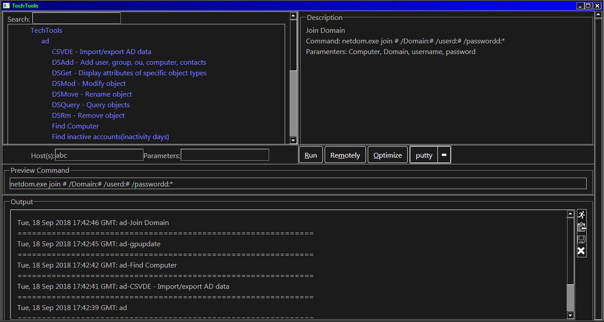

#TechTools

## Introduction

TechTools allows computer support technicians to organize, locate, and use the tools they need to solve a problems. There exists numerous tools and it becomes difficult to keep track of of them all. This tool allows technician to manage and organize tools, document how to use the tools, and link to web sites. Most command-line tools take parameters that technicians have to memorize or look up. This tool allows the technican to store the command with proper parameters for future use or have documentation in the description that assists the user in using the tool properly.

TechTools allows the user to execute the command quickly. Just fill in any parameters that are needed and click the "Run" button. Tools can configured to take parameters. This is done by placing placing "#" where a parameter is required. The "#"s are replaced with the parameter. The "Preview Command" section shows what the command that would be run. Clicking on "Run" button executes the command and any output is captured in the "Output" section.

Another feature is the "Run Highlighted". If the previous command you ran was not to your satisfaction, you can edit the command in the Output section, hightlight the edit, and click on the Launch icon to the right. This will run the new command.

While the "Run" button executes commands on the local computer, the "Remote" button allows the user to execute a command on a remote computer. Configure the command field with a "@" to signify where the host will be located in the command. You will need psexec(https://docs.microsoft.com/en-us/sysinternals/downloads/psexec) as well as administrative rights to perform this functon. Be sure to configure the psexec tool's location in settings.json. Storing the tool in the Windows folder is a good location.

The "Optimize" button runs a script of your choice. I have not included a script due to liability reasons and because every envionment is different. The script basically cleans temp files, defrags(back in the days of WinXP), remove old profiles, disables services, etc.

QuickTools shows a list of tools(configurable by editing json/quicktools.json) that can be quickly accessed without having to find them in the tree. These tools might include putty, remote desktop, or vnc. Put your commonly used tools here.

The output section logs any output the tool might produce. The user can copy the output or save to file.

The parameter field allows the user to enter the needed parameters based on the command template.

Included is a script (json_insert_attribute.rb) to download multiple software quickly. Technicans can store the download url or to share with other users.

The host field takes hostname or ip address of the destination device. This field cal also take a comma-seperated list of. For example, for a list like this hostA, hostB, hostC, the action would .

Adding categories:
	To add new categories, right-click on TechTools, choose create, and give it a name. A new file will be created to store the tools in this category. You can rename and delete the category. Be warned that deletion is permanent.

Adding tools:
	To add a tool, right-click on the category and choose create. An edit form will appear. Use this form to fill in the details of the tool. The name and command are mandatory. The command field is the command that will executed when the "Run" button is clicked. Command must be unique within same category. Click Save to save the data. Clicking on the tool again will show the description of the tool. Double-clicking opens the tool for editing.

A Tool is any executable that you can think up. You can use it to copy files to specific locations. It could also be run a command promopt and keeping the prompt available for further use by using cmd.exe's various options. Be creative.

	By putting "#" in the front of a command, that signifies that the command is DOS command and any output will be shown in the output field. If you need to keep the command open, use somethink like this: cmd.exe /K executable.exe (don't need # in front).

	computer field replaced with @ symbol
	parameter field replace value with # symbol

Shortcuts keys:
* ALT + e, Edit category or tool.
* ALT + d, Delete a category or tool. Deletions are is permanent.
* ALT + s, Save edit.
* ALT + r, Run a tool locally
* ALT + m, Run a tool remotely
* ALT + o, Optimize. Run optimize routine
* ALT + q, Run the selected quick tool
* ALT + c, Clear output
* These keys are hard coded into the application but can still be changed with ease.

Software Requirements
	Deveopled and tested on Windows 7. Should work on Windows XP and other versions of Windows that have mshta.exe but not tested.
	Administrative rights needed to execute on remote computers
	A common network share that is accessible

New Features:
	New ideas and features are welcome. This is an evolving product and I hope to continue to make it better. Please create an detailed issue. At some point, this tool will most likely be changed to use different technology. HTA worked well since I was calling functions from vbscript files but that has been removed during the rewrite(may put that back in the future). Right now, you can execute vbscript as individual files.

Notes:
	The tools that are currently present are just for example. They are real tools but it's better if you add tools that you are more familiar with. For liability and infringement reasons, I cannot provide the tools to you directly.

Psexec:
	Psexec is a tool from Sysinternals(Microsoft) that can execute a command on on remote computers (see https://docs.microsoft.com/en-us/sysinternals/downloads/psexec).

Reporting Bugs:
	Please create bug detailed reports(OS version, IE version, mshta.exe version, detailed description with screenshots) and I will try to solve as time allows. Do note that this runs under Microsoft's HTA technology which has many many limitations, many of which I may not be able to work around. I've already had to work

Pricing:
	This tool is free for personal use. For commerical usage, the first year is free. Any usage beyond the first year is $5 per year per seat. Please note that this is my full time job and $10 is pretty much nothing. I hope you find this tool useful.

A special thanks goes out to all the project's below:
* jquery, http://jquery.com, MIT
* jquery-ui, https://jqueryui.com, MIT
* jstree, https://www.jstree.com/, MIT
* jsonQ, https://github.com/s-yadav/jsonQ, MIT
* json-stringify-pretty-compact, https://github.com/lydell/json-stringify-pretty-compact, MIT
* bootstrap, https://getbootstrap.com/docs/4.1/about/license/, MIT
* popper, https://github.com/FezVrasta/popper.js/blob/master/LICENSE.md, MIT
* gremlins, https://github.com/marmelab/gremlins.js, MIT
* materialize, https://materializecss.com/, MIT
* font-awesome, https://fontawesome.com, Free version
* save icon, https://thenounproject.com/term/save/9016/, Creative Commons
* copy icon, https://octicons.github.com, MIT

